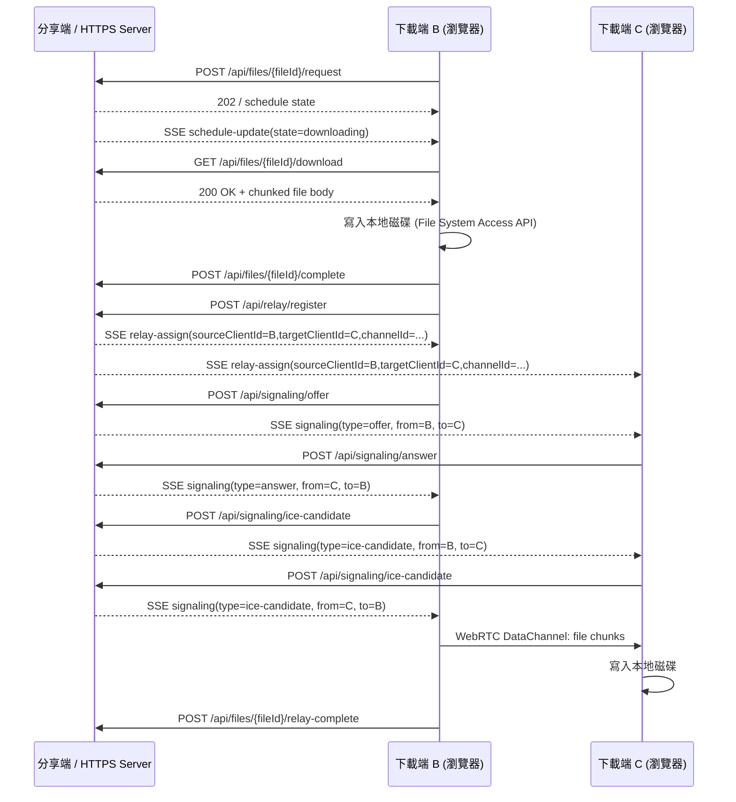

```mermaid
sequenceDiagram
    participant A as 分享端 / HTTPS Server
    participant B as 下載端 B (瀏覽器)
    participant C as 下載端 C (瀏覽器)

    %% B 向 A 申請下載檔案
    B->>A: POST /api/files/{fileId}/request
    A-->>B: 202 / schedule state

    %% A 透過 SSE 通知 B 開始 HTTP 下載
    A-->>B: SSE schedule-update(state=downloading)

    %% B 透過 HTTP 下載檔案
    B->>A: GET /api/files/{fileId}/download
    A-->>B: 200 OK + chunked file body
    B->>B: 寫入本地磁碟 (File System Access API)

    %% B 通知 A 下載完成並註冊為中繼
    B->>A: POST /api/files/{fileId}/complete
    B->>A: POST /api/relay/register

    %% A 通知 B 與 C 進行 WebRTC 中繼
    A-->>B: SSE relay-assign(sourceClientId=B,targetClientId=C,channelId=...)
    A-->>C: SSE relay-assign(sourceClientId=B,targetClientId=C,channelId=...)

    %% B 與 C 透過 A 交換 WebRTC 信令
    B->>A: POST /api/signaling/offer
    A-->>C: SSE signaling(type=offer, from=B, to=C)

    C->>A: POST /api/signaling/answer
    A-->>B: SSE signaling(type=answer, from=C, to=B)

    B->>A: POST /api/signaling/ice-candidate
    A-->>C: SSE signaling(type=ice-candidate, from=B, to=C)

    C->>A: POST /api/signaling/ice-candidate
    A-->>B: SSE signaling(type=ice-candidate, from=C, to=B)

    %% B 直接把檔案傳給 C
    B->>C: WebRTC DataChannel: file chunks
    C->>C: 寫入本地磁碟

    %% 傳輸完成回報
    B->>A: POST /api/files/{fileId}/relay-complete
```
